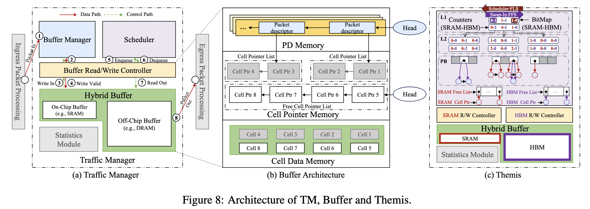

<h1 align="center">
  <br>
  Themis
  <br>
</h1>

<p align="center">
  Scheduling-Aware Buffer Management for HBM-Based Hybrid Buffers
</p>

<p align="center">
  <a href="#key-features">Key Features</a> •
  <a href="#repository-layout">Repository Layout</a> •
  <a href="#get-started">Get Started</a> •
  <a href="#requirements">Requirements</a> •
  <a href="#license">License</a>
</p>

<a id="key-features"></a>

## Key Features

- Scheduling-aware buffer management for SRAM/off-chip hybrid buffers.
- Rank-guided placement that keeps earlier-departing packets in low-latency storage whenever possible.
- Proactive migration across memory tiers instead of waiting for congestion to drain naturally.
- Batch-oriented off-chip organization for consecutively departing packets.
- A BM-SCH unified model built around BBQ and linked-cell buffer organization.



<a id="repository-layout"></a>

## Repository Layout

This repository keeps the two FPGA-oriented versions separated at the top level:

```text
hbm/
  docs/
  rtl/

ddr/
  rtl/
  sim/
  scripts/
```

- `hbm/` contains the HBM-oriented Themis RTL snapshot and Vivado IP configuration files.
- `ddr/` contains a U200 DDR-backed subsystem supplement with RTL, functional simulation, stripped synthesis, U200 build, and optional ILA utility scripts.

<a id="get-started"></a>

## Get Started

Run a lightweight HBM-version compilation sanity check:

```bash
iverilog -g2012 \
  -s themis_resource_eval_top \
  hbm/rtl/common/heap_ops.sv \
  hbm/rtl/common/ffs.sv \
  hbm/rtl/common/themis_memory_primitives.sv \
  hbm/rtl/core/bbq.sv \
  hbm/rtl/core/themis_linked_buffer_manager.sv \
  hbm/rtl/top/themis_resource_eval_top.sv
```

Run the DDR-version functional simulation:

```bash
vivado -mode batch -source ddr/scripts/run_themis_core_sim.tcl
```

Run stripped synthesis for the DDR-version core:

```bash
vivado -mode batch -source ddr/scripts/synth_stripped_core.tcl
```

Build the U200 DDR-backed self-test design:

```bash
vivado -mode batch -source ddr/scripts/build_u200_ddr.tcl
```

Generated Vivado outputs are intentionally ignored by Git.

<a id="requirements"></a>

## Requirements

**Hardware Requirements**

- The HBM version references the Xilinx Alveo U280 platform (`xilinx.com:au280:part0:1.1`) and compatible board files.
- The DDR version targets the Xilinx Alveo U200 platform and maps the off-chip tier to DDR4.

**Software Requirements**

- `iverilog`: SystemVerilog 2012 support for the HBM-version compilation sanity check.
- [Vivado Design Suite](https://www.xilinx.com/support/download/index.html/content/xilinx/en/downloadNav/vivado-design-tools/archive.html) >= `2020.2`.

<a id="license"></a>

## License

- `BSD-2-Clause-Views`
